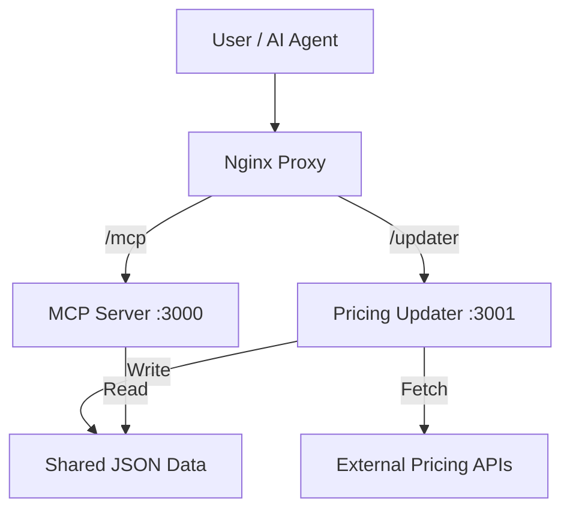

# CloudCost Intelligence MCP


**AI-native cost intelligence for cloud infrastructure, AI models, and SaaS subscriptions.**

CloudCost Intelligence is a Model Context Protocol (MCP) server that provides real-time cost estimation, optimization, and forecasting. It empowers AI agents to make cost-aware architecture decisions by accessing dynamic pricing data from AWS, Azure, GCP, OpenAI, Anthropic, and various SaaS providers.

---

## 🏗️ Architecture

The system consists of three main components:

1.  **MCP Server (Port 3000)**: The core intelligence engine exposing 21 tools.
2.  **Pricing Updater (Port 3001)**: A background service that fetches real-time pricing from external APIs (AWS Bulk API, Azure Retail Prices, etc.) and updates local JSON data.
3.  **Nginx**: Reverse proxy for secure routing and rate limiting.



---

## 🚀 Quick Start

### Prerequisites
- Node.js >= 18
- Docker & Docker Compose (optional)

### Local Development

1.  **Install dependencies:**
    ```bash
    npm install
    ```

2.  **Run in development mode:**
    ```bash
    # Runs MCP server
    npm run dev
    
    # In a separate terminal, run the updater
    npm run dev:updater
    ```

3.  **Test with MCP Inspector:**
    ```bash
    npm run inspect
    ```

### Docker Deployment

```bash
# Start all services (Server, Updater, Nginx)
docker compose up -d --build

# Check logs
docker compose logs -f
```

---

## 🛠️ Tool Reference

### 🧠 AI Model Intelligence (6 Tools)
*Optimize your AI spend with model comparisons and performance estimates.*

| Tool | Description | Key Inputs |
|------|-------------|------------|
| `estimateOpenAICost` | Calculate OpenAI costs with breakdown. | `model`, `inputTokens`, `outputTokens` |
| `estimateAnthropicCost` | Calculate Anthropic costs, incl. batch savings. | `model`, `inputTokens`, `outputTokens` |
| `suggestModel` | Recommend the best model for a task & budget. | `taskType`, `budget`, `latencyRequirement` |
| `compareModels` | Compare all models for a specific task. | `taskType` (chat, code, etc.) |
| `rankingByCostEfficiency` | Rank models by value-for-money. | `task` (natural language description) |
| `estimatePerformance` | Estimate latency and throughput. | `taskType`, `tokenSize` |

### ☁️ Cloud Infrastructure (5 Tools)
*Plan and forecast cloud spend across AWS, Azure, and GCP.*

| Tool | Description | Key Inputs |
|------|-------------|------------|
| `compareCloudCost` | Compare costs across clouds (Compute, Storage, DB). | `serviceType`, `usageProfile` |
| `estimateComputeCost` | Hourly/monthly compute cost & specs. | `provider`, `instanceType`, `hours` |
| `estimateStorageCost` | Storage cost with tiering optimization. | `provider`, `storageType`, `gb` |
| `estimateBandwidthCost` | Data transfer cost with CDN savings analysis. | `provider`, `gbTransfer`, `direction` |
| `forecastScalingCost` | Project future costs with growth rates & cliffs. | `currentMonthlyCost`, `growthRate`, `months` |

### 📉 SaaS & Burn Rate (5 Tools)
*Manage startup burn and optimize SaaS subscriptions.*

| Tool | Description | Key Inputs |
|------|-------------|------------|
| `calculateSaaSBurn` | Total burn analysis with category benchmarks. | `services` List (name, cost, category) |
| `suggestOptimalPlan` | Recommend best plan for SaaS (Vercel, Supabase...). | `serviceName`, `monthlyUsage` |
| `forecastRunway` | Calculate startup runway based on burn & revenue. | `monthlyInfraCost`, `cashInBank` |
| `costBreakdownByService` | Detailed spend breakdown by category. | `services`, `stage` (seed, series-a) |
| `recommendCostReductionStrategies` | Prioritized list of cost-saving actions. | `services` |

### ⚡ Advanced Optimization (5 Tools)
*Deep-dive analysis for architectural decisions.*

| Tool | Description | Key Inputs |
|------|-------------|------------|
| `multiCloudOptimization` | Strategies for multi-cloud workloads. | `workloadProfile`, `currentCosts` |
| `databaseTierRecommendation` | Right-size database tiers (Mongo, Neon, etc.). | `provider`, `currentUsage` |
| `modelSwitchSavings` | ROI analysis of switching AI models. | `currentModel`, `monthlyTokens` |
| `reservedInstanceSavings` | Analyze RI savings vs. On-Demand. | `provider`, `instanceType`, `usagePattern` |
| `breakEvenAnalysis` | Compare two options (e.g., Build vs Buy). | `optionA`, `optionB`, `timeHorizon` |

---

## 🔄 Pricing Updater Service

The **Pricing Updater** runs independently on port `3001` to ensure data freshness.

-   **Update Interval**: Default 6 hours (configurable via `UPDATE_INTERVAL`).
-   **Endpoints**:
    -   `GET /updater/status`: Check last update time and status.
    -   `POST /updater/trigger`: Manually trigger a pricing update.
-   **Data Sources**:
    -   **AWS**: Bulk API & Spot Price Indices.
    -   **Azure**: Retail Prices API.
    -   **SaaS**: Public pricing pages/APIs for Vercel, Supabase, MongoDB, etc.

---

## ⚙️ Configuration

Create a `.env` file or set environment variables:

| Variable | Default | Description |
|----------|---------|-------------|
| `PORT` | `3000` | MCP Server port |
| `UPDATE_PORT` | `3001` | Pricing Updater port |
| `UPDATE_INTERVAL` | `6` | Hours between pricing updates |
| `NODE_ENV` | `production` | `development` or `production` |

---

## 🚢 CTX Protocol Integration

To register with the CTX marketplace, use the following configuration:

```yaml
name: cloudcost-mcp
endpoint: https://your-domain.com/mcp
description: AI-native cost intelligence for cloud, AI models, and SaaS
pricing:
  free:
    requests_per_day: 100
  pro:
    price: 10
    requests_per_day: unlimited
```

---

## 📜 License

This project is licensed under the MIT License.